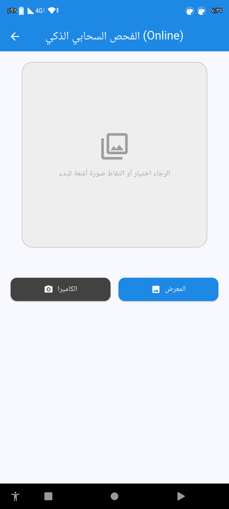
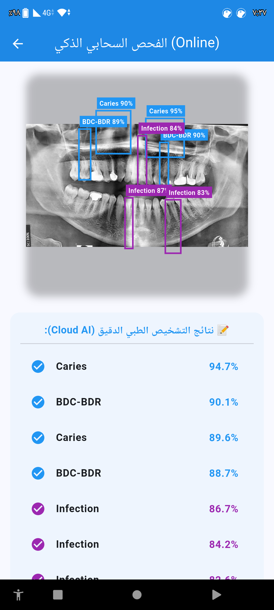

# Dental Online App

Dental Online App is a mobile application that uses artificial intelligence to analyze dental images and X-ray scans. The project combines a YOLOv8 model, a FastAPI backend, and a Flutter mobile application to provide a simple and accessible dental screening solution.

---

## Project Overview

The main goal of this project is to provide an initial analysis of dental conditions using computer vision and deep learning techniques. Users can capture or upload an image, send it to a cloud-based API, and receive analysis results directly on their mobile device.

The system is designed as an educational and research project and demonstrates the integration of AI models with mobile applications.

---

## Project Objectives

- Provide a fast preliminary assessment of dental conditions.
- Demonstrate the use of AI in healthcare-related applications.
- Create a complete system that combines AI, cloud services, and mobile development.
- Offer a user-friendly interface for image analysis.
- Build a foundation that can be extended with additional dental diagnostic features.

---

## System Architecture

The system consists of three main components:

- Flutter Mobile Application
- FastAPI Backend API
- YOLOv8 AI Model

The mobile application sends dental images to the API. The backend processes the image using the trained YOLO model and returns the detection results to the user.

---

## Technologies Used

### AI Model Training

| Technology | Purpose |
|------------|---------|
| YOLOv8 | Object Detection Model |
| Ultralytics | Model Training Framework |
| Google Colab | Training Environment |
| Roboflow / LabelImg | Data Annotation and Preparation |

### Backend API

| Technology | Purpose |
|------------|---------|
| FastAPI | API Development |
| Python 3.9 | Programming Language |
| Docker | Containerization |
| Uvicorn | API Server |
| Hugging Face Spaces | Cloud Deployment |

### Mobile Application

| Technology | Purpose |
|------------|---------|
| Flutter | Mobile App Development |
| Dart | Application Logic |
| image_picker | Image Selection |
| http | API Requests |
| flutter_spinkit | Loading Indicators |

---

## Screenshots

| Home Screen | Upload Image | Analysis Result |
|:---:|:---:|:---:|
|  |  |  |

> Place your screenshots inside:
>
> `assets/screenshots/`

---

## AI Model Training

### Dataset Preparation

The dataset consists of dental images and X-ray scans that were annotated using bounding boxes to identify different dental conditions.

### Training Process

1. Data collection and preparation.
2. Image annotation using Roboflow or LabelImg.
3. Transfer learning using pretrained YOLOv8 weights.
4. Model training and validation.
5. Exporting the best model as `best.pt`.

### Training Environment

- Google Colab
- GPU Acceleration
- Ultralytics YOLOv8

### Model Output

The trained model generates:

- Detected dental conditions
- Confidence scores
- Bounding box coordinates

---

## Backend API

### Endpoint

```http
POST https://alhakimia54-dental-api-v2.hf.space/predict
```

### Request Format

- Method: POST
- Content-Type: multipart/form-data
- Parameter: file

### Example Response

```json
{
  "detections": [
    {
      "label": "caries",
      "confidence": 0.95,
      "x": 0.25,
      "y": 0.30,
      "w": 0.40,
      "h": 0.35
    }
  ]
}
```

### Backend Structure

```text
api/
├── main.py
├── requirements.txt
├── Dockerfile
├── best.pt
└── README.md
```

---

## Flutter Mobile Application

### Features

- Capture images using the camera.
- Select images from the gallery.
- Send images to the AI API.
- Display analysis results.
- Show confidence scores and detected regions.

### Application Structure

```text
dental_online_app/
│
├── lib/
│   ├── main.dart
│   └── scan_screen.dart
│
├── assets/
│   └── images/
│       └── online_logo.png
│
├── pubspec.yaml
└── README.md
```

### Dependencies

```yaml
dependencies:
  image_picker: ^1.1.2
  http: ^1.2.0
  flutter_spinkit: ^5.2.1
```

---

## Project Structure

```text
dental-project/
│
├── api/
│   ├── main.py
│   ├── requirements.txt
│   ├── Dockerfile
│   ├── best.pt
│   └── README.md
│
├── dental_online_app/
│   ├── lib/
│   ├── assets/
│   ├── pubspec.yaml
│   └── README.md
│
├── assets/
│   └── screenshots/
│       ├── home.png
│       ├── upload.png
│       └── result.png
│
└── README.md
```

---

## How the System Works

```text
1. User selects an image
          ↓
2. Flutter app uploads the image
          ↓
3. FastAPI receives the request
          ↓
4. YOLO model processes the image
          ↓
5. Detection results are generated
          ↓
6. Results are returned as JSON
          ↓
7. Flutter displays the analysis
```

---

## Installation and Setup

### Requirements

#### Backend

- Python 3.9+
- Git LFS
- Hugging Face Account

#### Mobile Application

- Flutter 3.0+
- Android Studio or Xcode
- Android Device or Emulator

### Clone the Repository

```bash
git clone https://github.com/your-repository/dental-project.git
cd dental-project
```

### Run the Backend

```bash
cd api
pip install -r requirements.txt
uvicorn main:app --host 0.0.0.0 --port 7860
```

### Run the Flutter Application

```bash
cd dental_online_app
flutter pub get
flutter run
```

---

## Future Improvements

- Convert the model to ONNX format for faster inference.
- Add offline inference using TensorFlow Lite.
- Store previous scan history in a database.
- Improve multilingual support.
- Add user authentication.
- Develop a dashboard for dentists.
- Enable result sharing with healthcare professionals.
- Expand support for additional dental conditions.

---

## Disclaimer

This project was developed for educational and research purposes.

The analysis results provided by the AI model should not be considered a replacement for professional medical advice or diagnosis. Users should always consult a qualified dental professional for medical decisions and treatment.

---

## Contact

**Ahmed Alhakimi**

LinkedIn:

https://www.linkedin.com/in/احمد-الحكيمي-833380344

Portfolio:

https://sites.google.com/view/ahmed-alhakimi-tech

---

## License

This project is available for educational and non-commercial use.