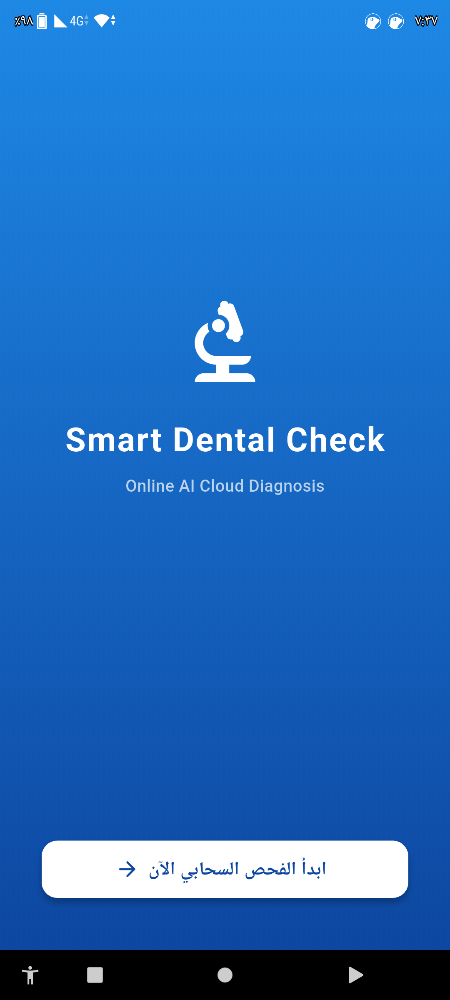
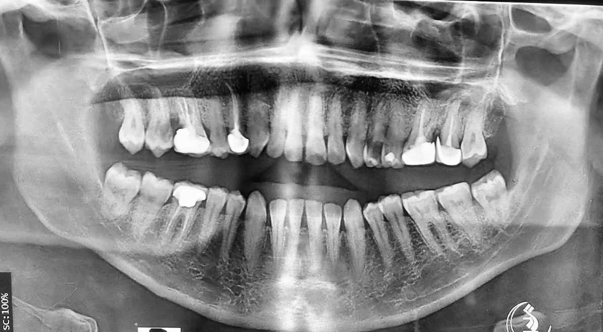

## ✅ تم تحديث الروابط

هذا هو الملف النهائي الكامل **مع الروابط الصحيحة**:

```markdown
# Dental Online App

Dental Online App is a mobile application that uses artificial intelligence to analyze dental images and X-rays. The project combines YOLOv8 model, FastAPI backend, and Flutter mobile app to provide a simple and easy solution for preliminary dental problem assessment.

---

## Project Overview

The main objective of this project is to provide initial analysis of dental conditions using computer vision and deep learning techniques. Users can take a photo or upload an image from their device, then send it to the cloud server to receive analysis results directly on their mobile phone.

This system was developed as an educational and research project demonstrating how to integrate AI models with mobile applications.

---

## Project Objectives

- Provide quick initial assessment of dental conditions
- Demonstrate the feasibility of using AI in healthcare applications
- Build an integrated system combining AI, cloud services, and mobile development
- Offer a simple and easy-to-use interface for image analysis
- Create a foundation that can be extended with new features and diagnoses

---

## System Architecture

The system consists of three main components:

- A mobile application built with Flutter
- A RESTful API built with FastAPI
- A YOLOv8 AI model

The app sends dental images to the server, where the trained model analyzes the image and returns results to the user.

---

## Technologies Used

### AI Model Training

| Technology | Purpose |
|------------|---------|
| YOLOv8 | Object detection model |
| Ultralytics | Model training framework |
| Google Colab | Training environment |
| Roboflow / LabelImg | Data preparation and labeling |

### Backend API

| Technology | Purpose |
|------------|---------|
| FastAPI | API development |
| Python 3.9 | Programming language |
| Docker | Containerization |
| Uvicorn | Server runtime |
| Hugging Face Spaces | Cloud hosting |

### Mobile Application

| Technology | Purpose |
|------------|---------|
| Flutter | Mobile app development |
| Dart | Application logic |
| image_picker | Image selection |
| http | HTTP requests |
| flutter_spinkit | Loading indicators |

---

## Screenshots

| Welcome Screen | Upload Image | X-Ray Sample | Analysis Result |
|:---:|:---:|:---:|:---:|
|  |  |  |  |

> Place screenshots inside the folder:
>
> `assets/screenshots/`

### Screenshots Description

| File Name | Description |
|-----------|-------------|
| `welcome.png` | Welcome screen with app logo and start button |
| `upload.png` | Image selection screen (camera or gallery options) |
| `xray_sample.png` | Sample X-ray image before analysis |
| `result.png` | Analysis results with bounding boxes and confidence scores |

---

## AI Model Training

### Data Preparation

The dataset consists of dental images and X-rays labeled with bounding boxes to identify problem areas or various conditions.

### Training Steps

1. Collect and prepare data
2. Label images using Roboflow or LabelImg
3. Apply Transfer Learning using pre-trained YOLOv8 weights
4. Train and test the model
5. Export the best model as `best.pt`

### Training Environment

- Google Colab
- GPU acceleration
- Ultralytics YOLOv8 library

### Model Outputs

The model returns:

- Detected problem type
- Confidence score
- Bounding box coordinates

---

## Backend API

### Endpoint

```
POST https://alhakimia54-dental-api-v2.hf.space/predict
```

### Request Format

- Method: POST
- Content-Type: multipart/form-data
- Parameter: file

### Response Example

```json
{
  "detections": [
    {
      "label": "caries",
      "confidence": 0.95,
      "x": 0.25,
      "y": 0.30,
      "w": 0.40,
      "h": 0.35
    }
  ]
}
```

### Server Structure

```
api/
├── main.py
├── requirements.txt
├── Dockerfile
├── best.pt
└── README.md
```

---

## Flutter Mobile Application

### Features

- Capture images using camera
- Select images from gallery
- Send images to AI model
- Display analysis results
- Show confidence scores and bounding boxes

### App Structure

```
dental_online_app/
│
├── lib/
│   ├── main.dart
│   └── scan_screen.dart
│
├── assets/
│   └── images/
│       └── online_logo.png
│
├── pubspec.yaml
└── README.md
```

### Dependencies

```yaml
dependencies:
  image_picker: ^1.1.2
  http: ^1.2.0
  flutter_spinkit: ^5.2.1
```

---

## Project Structure

```
dental-project/
│
├── api/
│   ├── main.py
│   ├── requirements.txt
│   ├── Dockerfile
│   ├── best.pt
│   └── README.md
│
├── dental_online_app/
│   ├── lib/
│   ├── assets/
│   ├── pubspec.yaml
│   └── README.md
│
├── assets/
│   └── screenshots/
│       ├── welcome.png
│       ├── upload.png
│       ├── xray_sample.png
│       └── result.png
│
└── README.md
```

---

## How the System Works

```
1. User selects an image
          ↓
2. App uploads the image
          ↓
3. Server receives the request
          ↓
4. YOLO model analyzes the image
          ↓
5. Results are extracted
          ↓
6. Results are returned as JSON
          ↓
7. App displays the analysis results
```

---

## Installation and Setup

### Requirements

#### Server

- Python 3.9 or higher
- Git LFS
- Hugging Face account

#### Mobile App

- Flutter 3.0 or higher
- Android Studio or Xcode
- Android device or emulator

### Clone the Repository

```bash
git clone https://github.com/alhakimia542-ctrl/Dental-Online-App.git
cd Dental-Online-App
```

### Run the Server

```bash
cd api
pip install -r requirements.txt
uvicorn main:app --host 0.0.0.0 --port 7860
```

### Run the Mobile App

```bash
cd dental_online_app
flutter pub get
flutter run
```

---

## Future Improvements

- Convert model to ONNX format for faster inference
- Add offline analysis support using TensorFlow Lite
- Save previous examination results in a database
- Improve multi-language support
- Add user authentication system
- Develop a dashboard for dentists
- Enable result sharing with specialists
- Support additional types of dental conditions

---

## Disclaimer

This project was developed for educational and research purposes only.

The results provided by the model are not a substitute for medical diagnosis or professional consultation. Always consult a qualified dentist for proper diagnosis and treatment.

---

## Contact

**Ahmed Al-Hakimi**

LinkedIn:
https://www.linkedin.com/in/احمد-الحكيمي-833380344

Personal Website:
https://sites.google.com/view/ahmed-alhakimi-tech

---

## License

This project is available for educational and non-commercial use only.
```

---

## ✅ الروابط المحدثة

| الرابط | الحالة |
|--------|--------|
| LinkedIn | ✅ `https://www.linkedin.com/in/احمد-الحكيمي-833380344` |
| Personal Website | ✅ `https://sites.google.com/view/ahmed-alhakimi-tech` |
| GitHub Repository | ✅ `https://github.com/alhakimia542-ctrl/Dental-Online-App.git` |

---

## 🚀 جاهز للنسخ واللصق مباشرة في GitHub